# Python Coach

**Python Coach** is an adaptive, interactive Python tutoring platform designed to help learners master Python programming through personalized question recommendations, step-by-step breakdowns, real-time code evaluation, and actionable feedback. It leverages state-of-the-art vector search, Elo-based personalization, and Google Gemini LLMs to deliver a seamless learning experience.

---

## 🚀 Features

* **Adaptive Question Recommendation**: Uses FAISS-driven vector search combined with per-user Elo ratings to suggest tailored Python exercises.
* **Interactive Breakdown Tutor**: Guides learners through problems in incremental steps, encouraging deep understanding before coding.
* **Code Evaluation & Scoring**: Automatically grades submitted solutions on multiple topics, updating user Elo to refine future recommendations.
* **Expert Feedback Agent**: Provides detailed, actionable code reviews based on best practices (PEP 8, efficiency, edge cases).
* **Doubt Resolution Agent**: Answers ad-hoc Python questions, ensuring learners stay unblocked.
* **Full-Stack Web App**: FastAPI backend with SQLAlchemy, FAISS index, and Gemini integration; React-based frontend for a smooth user experience.

---

## 🏗️ Architecture Overview

```plaintext
+-------------------+       +-------------------------+       +-----------------
|                   |       |                         |       |                 |
|   React Frontend  | <-->  |     FastAPI Backend     | <-->  |  Google Gemini  |
|  (Login, Qn, Eval)|       |  (UserRoutes, QRoutes)  |       |    Gemini-1.5   |
|                   |       |                         |       |                 |
+-------------------+       +----------+--------------+       +-----------------
                                         |
                             +-----------v-----------+
                             |      FAISS Index      |
                             +-----------------------+
                                         |
                             +-----------v-----------+
                             |   PostgreSQL/SQLite   |
                             |  (Users, Attempts)    |
                             +-----------------------+
```

**Backend Components**:

* **`App.Routes.user_routes`**: User creation, lookup, and Elo updates
* **`App.Routes.question_routes`**: Fetch questions, breakdown flows, eval & feedback endpoints
* **Agents** (`DoubtAgent`, `BreakdownAgent`, `EvalAgent`, `FeedbackAgent`): Wrap Gemini LLM calls for tutoring functionalities
* **`questions_query.queryDB`**: Manages FAISS-based retrieval and attempted-question tracking
* **SQLAlchemy Models**: `Users`, `AttemptedQuestion` for persistence

**Frontend Components**:

* **LoginPage**: User sign-in or creation
* **NewQuestionPage**: Topic selection or Elo-based fetch
* **BreakDownPage**: Stepwise tutoring dialogue
* **EvalPage**: Code editor, grading, Elo update, feedback display

---

## 📝 Getting Started

### Prerequisites

* **Python 3.10+**
* **Node.js 16+ & npm**
* **Google Gemini API Key** (set as `GEMINI_API_KEY` in `.env`)
* **Questions Metadata & FAISS Index**

  * `METADATA_PATH`: Path to `questions_metadata.json`
  * `FAISS_INDEX_PATH`: Path to `questions_vector_database.index`

### Installation

1. **Clone the repository**

   ```bash
   git clone https://github.com/GG2k4/Python-Coach.git
   cd Python-Coach
   ```

2. **Backend Setup**

   ```bash
   pip install -r requirements.txt
   cp .env.example .env   # configure your GEMINI_API_KEY, METADATA_PATH, FAISS_INDEX_PATH
   uvicorn main:app --host 0.0.0.0 --port 8000 --reload
   ```

3. **Frontend Setup**

   ```bash
   cd frontend            # if code organized in frontend/ directory
   npm install
   npm start              # runs at http://localhost:3000
   ```

4. **Access the App**

   * Frontend: `http://localhost:3000`
   * API Docs: `http://localhost:8000/docs`

---

## 🔌 API Reference

### User Endpoints

| Method | Endpoint                      | Description               |
| ------ | ----------------------------- | ------------------------- |
| POST   | `/api/users`                  | Create a new user         |
| GET    | `/api/users/{user_id}`        | Retrieve user by ID       |
| GET    | `/api/users?user_name={name}` | Retrieve user by username |
| PUT    | `/api/users/{user_id}/elo`    | Update user Elo scores    |

### Question Endpoints

| Method | Endpoint                         | Description                                   |
| ------ | -------------------------------- | --------------------------------------------- |
| POST   | `/api/questions/`                | Fetch a new question (Elo or topic-based)     |
| PUT    | `/api/questions/breakdown_setup` | Initialize breakdown dialog                   |
| PUT    | `/api/questions/breakdown`       | Continue breakdown with user response         |
| PUT    | `/api/questions/breakdown_clear` | Clear breakdown state                         |
| POST   | `/api/questions/eval`            | Evaluate submitted code, returns topic scores |
| POST   | `/api/questions/feedback`        | Get detailed feedback on submitted code       |

---

## 📂 Project Structure

```plaintext
├── App/
│   ├── Routes/               # FastAPI route definitions
│   ├── Agents/               # LLM agent wrappers
│   ├── Services/             # Business logic for users and questions
│   ├── DB/                   # FAISS index & metadata
│   ├── Commons/              # Shared modules (schemas, database, models)
│   └── main.py               # Entry point for FastAPI app
├── frontend/                 # React application
│   ├── Pages/
│   └── App.js
├── requirements.txt          # Python dependencies
├── package.json              # Frontend dependencies
└── README.md                 # This file
```

---

## 🔄 End-to-End Workflow

Below is a professional, vertical flowchart illustrating the complete user journey and system interactions. Spacing has been increased for clarity, and interactive UI icons are part of the preview interface only—they won’t appear in the static README view.

```mermaid
%%{init: {'flowchart': {'nodeSpacing': 40, 'rankSpacing': 40}}}%%
flowchart TB
  A([User logs in]) --> B{Is user new?}
  B -- "Yes" --> C([Create new user record in database])
  B -- "No" --> D([Load existing user profile])
  C --> E([Determine user's internal Elo score or preferred topics])
  D --> E
  E --> F([Fetch best‑suited question from database based on performance])
  F --> G([BreakdownAgent guides the user through the question])
  G --> H([User submits code solution])
  H --> I([EvalAgent evaluates code and FeedbackAgent provides actionable feedback])
  I --> J([Update performance metrics and Elo ratings in database])
  J --> K([Redirect to New Question Page for next exercise])
  K --> E
```


